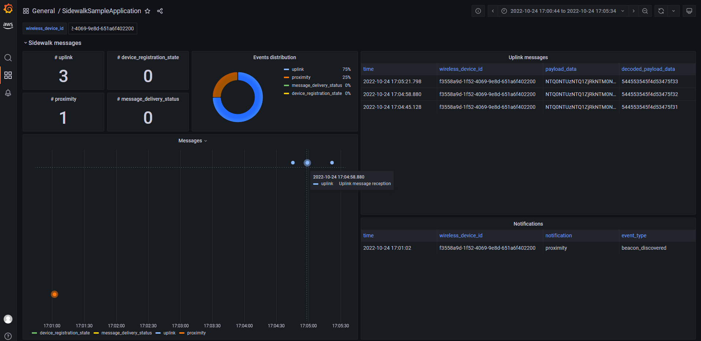
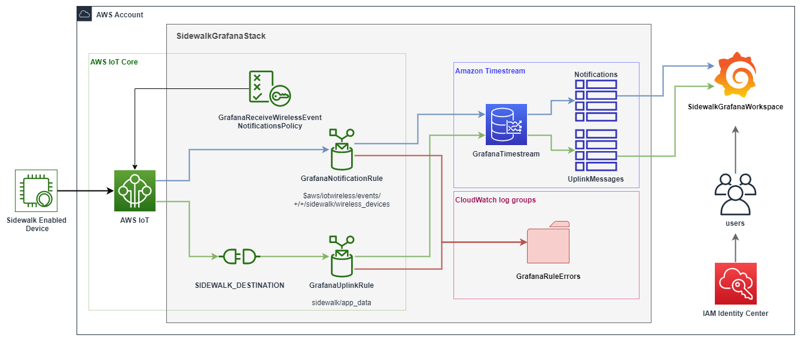
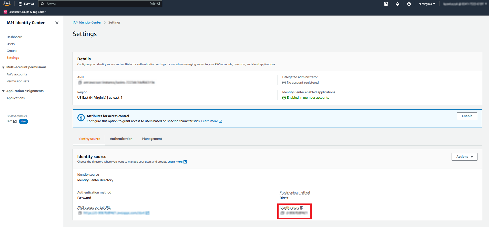
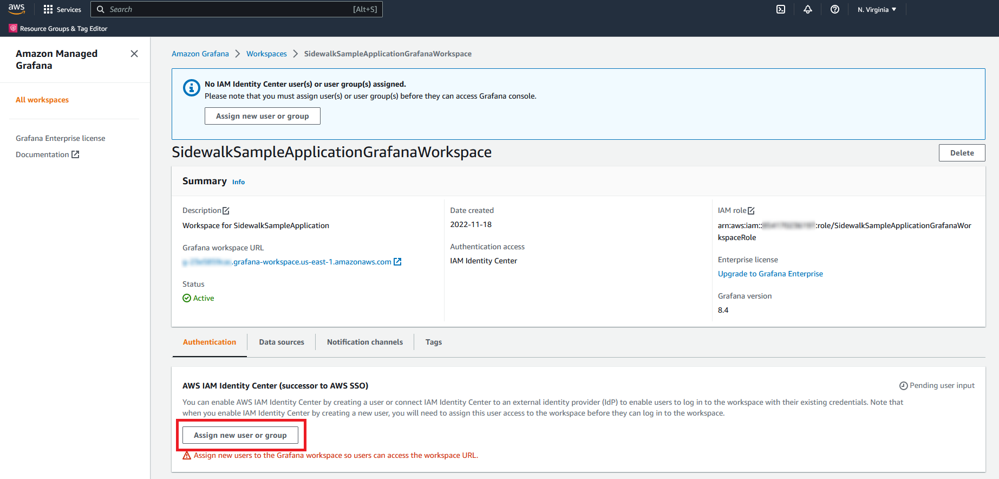
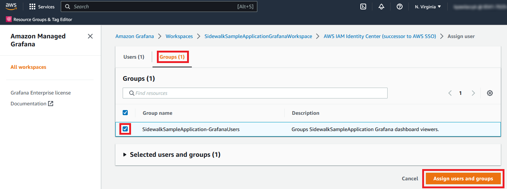
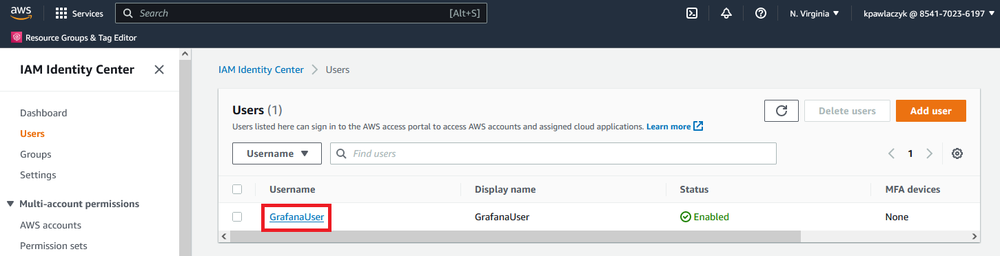
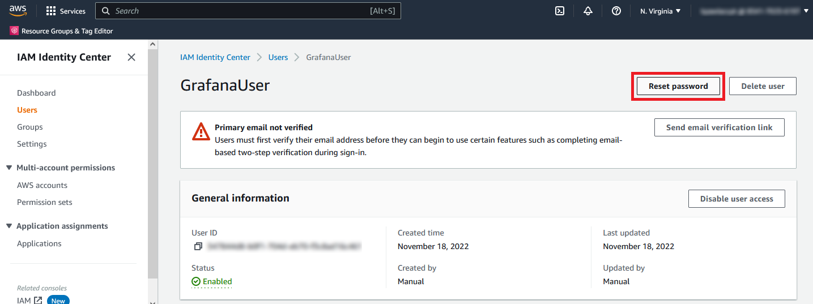
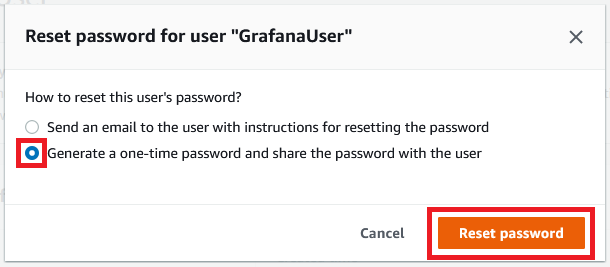
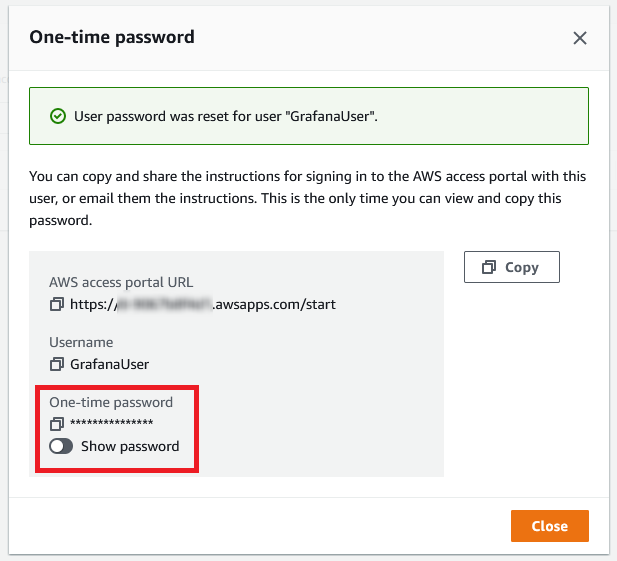
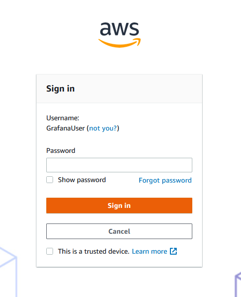

# Amazon Sidewalk Sample IoT App - Grafana extension

Grafana extension enables you to create an AWS Grafana workspace to visualize incoming uplinks and notifications.

### Additional prerequisties

- AWS account with IAM Identity Center enabled: https://docs.aws.amazon.com/singlesignon/latest/userguide/get-started-enable-identity-center.html

### Grafana workspace

Grafana stack provides the data visualization via Grafana dashboard. 
Dashboard reads the data stored in *Notifications* and *UplinkMessages* tables 
and displays information in a single view with different widgets. 
Whenever new uplink or notification appears, it is visible on the dashboard. You can filter the data using *wireless_device_id* variable.

Access to the dashboard is restricted to the users created in IAM Identity Center and assigned to the Amazon Grafana 
workspace.

|  |
|---|
| *Grafana extension - dashboard with exemplary data collected from the wireless device* |


### Cloud infrastructure

Grafana extension works on top of the Sensor Monitoring Application stack.
It adds two tables to the *SidewalkTimestream* database:
- *UplinkMessages* - which stores payload of the incoming uplink messages
- *Notifications* - which stores incoming notifications

It also provides a Grafana dashboard for tracing incoming messages.
Mentioned tables are datasource for the dashboard.

Components of the Grafana extension are depicted by the diagram below.
In order not to obscure the picture, some resources of the main stack are not shown.
Components are connected by arrows, which represent dataflow. Color denotes message type:
- green --> *uplink*
- blue --> *notification*
- red --> *error*

|  |
|---|
| *Grafana extension - resources and dataflow* |

*SidewalkSampleApplicationStack* has a *DeployGrafana* parameter, which, when set, modifies/deploys following resources:

- *SidewalkUplinkRule* - an action is added, which forwards incoming uplinks to the *UplinkMessages* table
  

- *SidewalkNotificationRule* - an action is added, which forwards incoming notifications to the *Notifications* table
  

- *UplinkMessages* - stores uplink messages
  

- *Notifications* - stores notifications

### Stack deployment

|WARNING: You will be billed for the usage of AWS resources created by this application. In particular, you will be charged for every active user of the Grafana dashboard. Keep in mind that every deployment creates an API key needed to setup the dashboard and data sources, what is counted as a single user with admin permissions. |
|---|

1. Ensure that you already deployed the main stack by running *deploy_stack.py*


2. Update the [config_grafana](./config_grafana.yaml) in the SidewalkSampleApplication package if needed:  

    - *IDENTITY_STORE_ID* - The globally unique identifier for the identity store, such as d-1234567890.   
      This value can be read from the IAM Identity Center -> Settings view.  
      If you want the script to create Grafana workspace users for you, you need to specify this value.
      
      |  |
      |---|
      | *Identity store ID can be read from the IAM Identity Center -> Settings view* |
    
    - *IDENTITY_CENTER_USERS* - list of users to be created in the identity store and grouped into the 
      *SidewalkSampleApplication-GrafanaUsers group*.  
      By default, script creates a single user - *GrafanaUser*. 
      Each user must be described with the following mandatory fields:
        - *USER_NAME* -  user's unique identifier
        - *FIRST_NAME* - user's first name
        - *LAST_NAME* - user's last name
          
        If you want the script to create Grafana workspace users for you, you need to specify this value.
    
    
3. Update base stack with Grafana-related resources and create Grafana workspace using the *deploy_grafana.py* script:
   ```
   python3 ApplicationServerDeployment/deploy_grafana.py
   ```
   
4. Assign users to the Grafana workspace.  
   Log into your AWS account, navigate to the *AmazonGrafana* and click *All workspaces*.  
   Select *SidewalkSampleApplicationGrafanaWorkspace* and then *Assign new user or group*. 
   
   |  |
   |---|
   | *Grafana - SidewalkSampleApplicationGrafanaWorkspace* |
   
   Switch to the *Groups* tab.   
   Select *SidewalkSampleApplication-GrafanaUsers* group.
   All users created by the *deploy_stack.py* belong to this group.  
   Click *Assign users and groups*.
   *SidewalkSampleApplication-GrafanaUsers* will be assigned to the workspace with *Viewer* permissions.

   |  |
   |---|
   | *Grafana - Assign group to the workspace* |

5. Create One-time password for your user.  
   Navigate to the IAM Identity Center and click on the name of the user you want to use to log in 
   (it should be a member of *SidewalkSampleApplication-GrafanaUsers*).
   
   |  |
   |---|
   | *Identity center - Users* |

   Click on *Reset password*.
   
   |  |
   |---|
   | *Identity center - particular user panel* |

   Select the *Generate a one-time password and share the password with the user* option. Click *Reset password*.

   |  |
   |---|
   | *Generate one-time password panel* |

    Record the One-time password for the created user.
   
    |  |
    |---|
    | *One-time password panel* |


6. Navigate to the Grafana dashboard using address provided by the *deploy_stack.py* script 
   (it is also stored in the *config.json* and accessible via Amazon Grafana console).  
   Log in using One-time password configured in the previous step.
   
   |  |
   |---|
   | *Grafana dashboard - sign in page* |
   
   After logging in, you should be able to see the SidewalkSampleApplication dashboard. 
   Send an uplink message from your device and refresh the dashboard, to confirm that it was successfully received by 
   the deployed infrastructure.
   

### Stack Deletion

Deletion of the stack and grafana workspace can be done automatically (using the *delete_stack.py*) or manually (from the AWS console).  
IAM Identity Center users (read from the [config_grafana](./config_grafana.yaml)), may or may not be deleted depending on the user input.

 - OPTION A - automatically using script
   - deleting only the Grafana extension: 
        ```
        python3 ApplicationServerDeployment/delete_grafana.py
        ```
   - deleting the whole stack: 
        ```
        python3 ApplicationServerDeployment/delete_stack.py
        ```
 - OPTION B - manually from the AWS console  
   Go to the AWS console, select the resource, and click delete.  
   The links bellow are for us-east-1; if you created your stack in another region make sure you go there.
    - CloudFormation: https://us-east-1.console.aws.amazon.com/cloudformation/home?region=us-east-1#/stacks
    - Grafana: https://us-east-1.console.aws.amazon.com/grafana/home?region=us-east-1#/workspaces
    
### Created resources

| Resource Type | Console Location | Name |
| ------------- | -------- | ---- |
| AWS::CloudFormation::Stack     | Lambda -> Applications                                   | SidewalkSampleApplicationStack
| AWS::Timestream::Table         | Timestream -> Databases -> SidewalkTimestream -> Tables  | UplinkMessages
| AWS::Timestream::Table         | Timestream -> Databases -> SidewalkTimestream -> Tables  | Notifications
| Amazon Grafana Workspace       | Amazon Grafana -> Workspaces                             | SidewalkSampleApplicationGrafanaWorkspace

## Security

The sample code; software libraries; command line tools; proofs of concept; templates; or other related technology (including any of the foregoing that are provided by our personnel) is provided to you as AWS Content under the AWS Customer Agreement, or the relevant written agreement between you and AWS (whichever applies). You should not use this AWS Content in your production accounts, or on production or other critical data. You are responsible for testing, securing, and optimizing the AWS Content, such as sample code, as appropriate for production grade use based on your specific quality control practices and standards. Deploying AWS Content may incur AWS charges for creating or using AWS chargeable resources, including but not limited to running Amazon Lambda instances or using Amazon Timestream storage.

See [CONTRIBUTING](../CONTRIBUTING.md#security-issue-notifications) for more information.

## License

This library is licensed under the MIT-0 License. See the [LICENSE](LICENSE) file.
