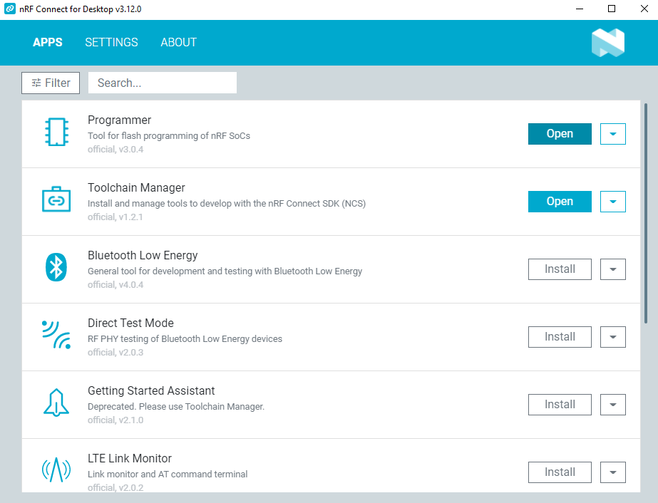
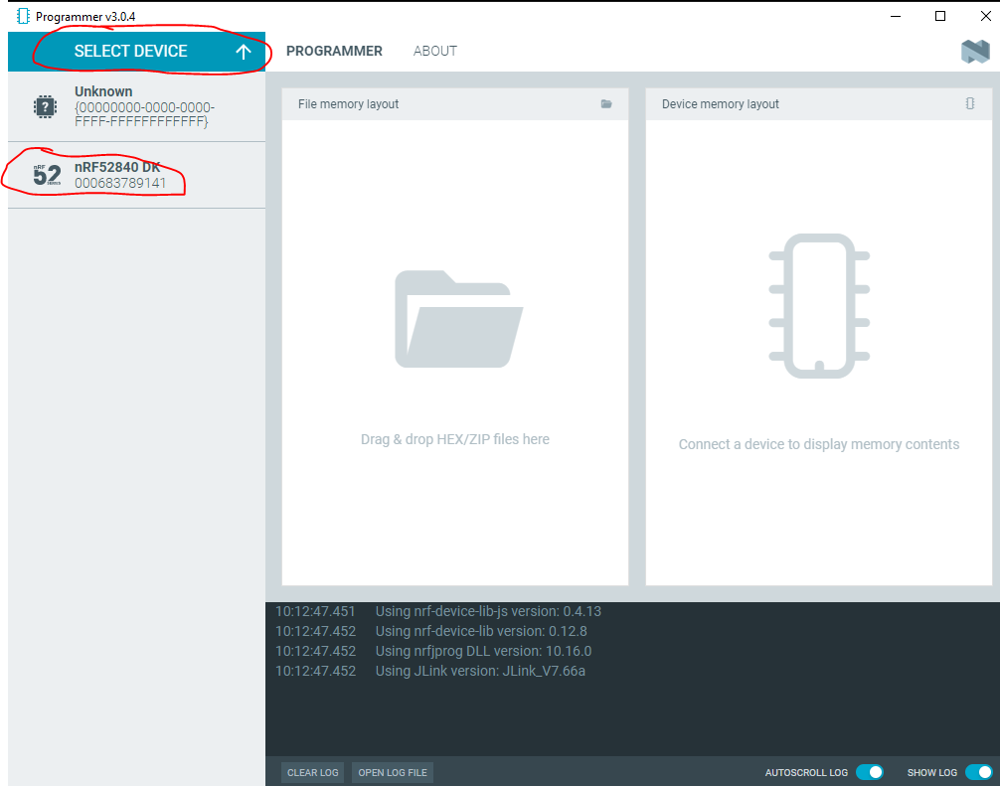
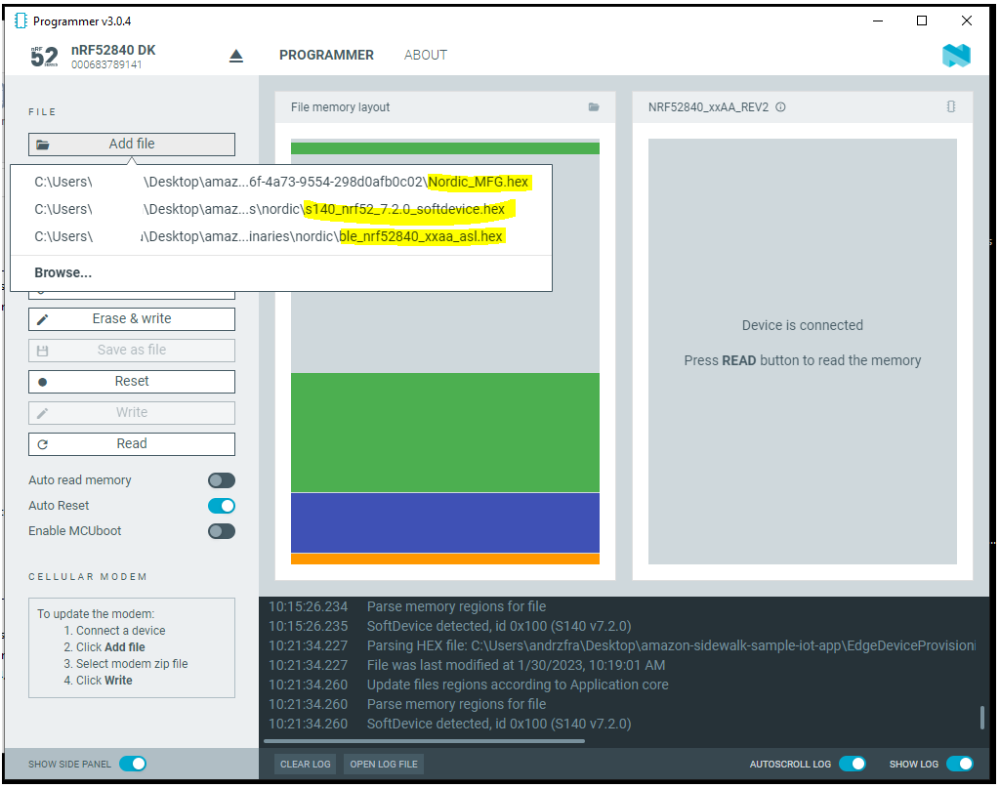
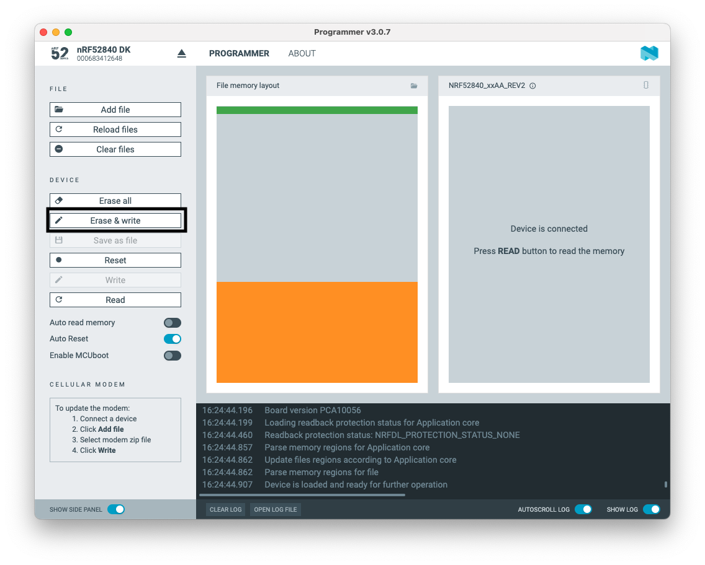
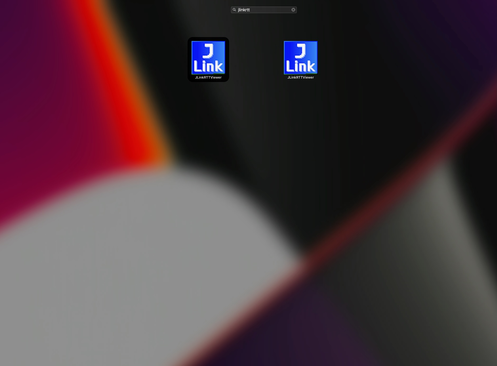
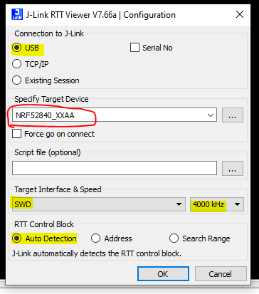
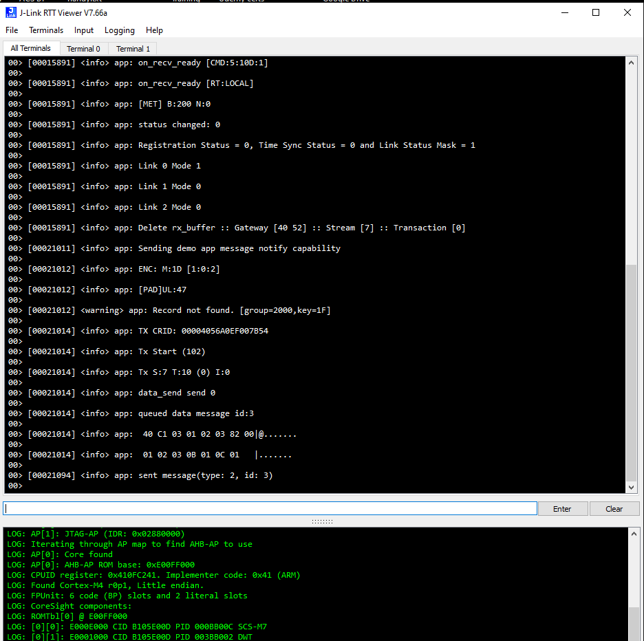

## Brief

## Step by step
1) Open nRF Connect utility and select Programmer

2) Select device from drop-down list. Wait for board to initialize.

3) Add files that you wish to program:  
   1) Nordic_MFG (from EdgeDeviceProvisioning)
   2) soft_device.hex (from EdgeDeviceBinaries)
   3) application.hex (from EdgeDeviceBinaries)

4) Erase & Write the binaries.

5) After programming the board, open RTT terminal and see logs flowing

