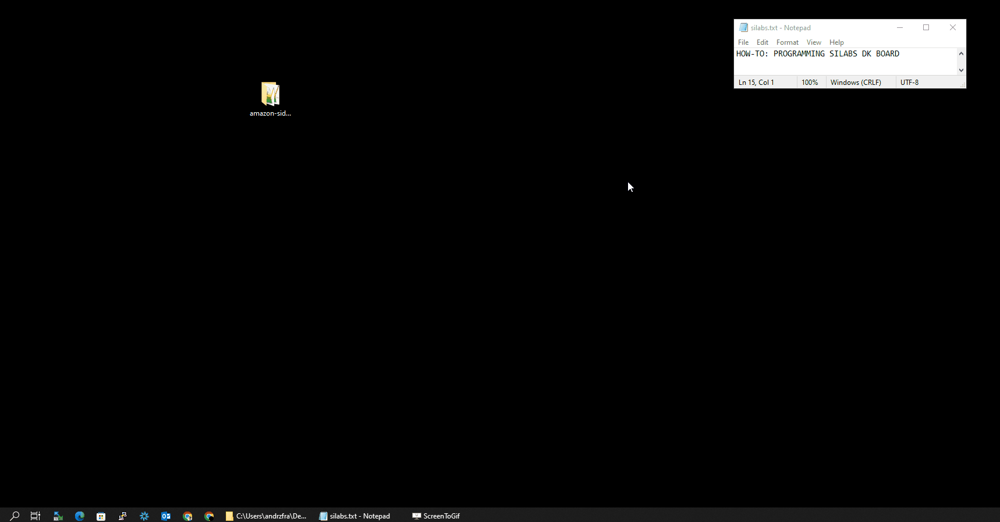
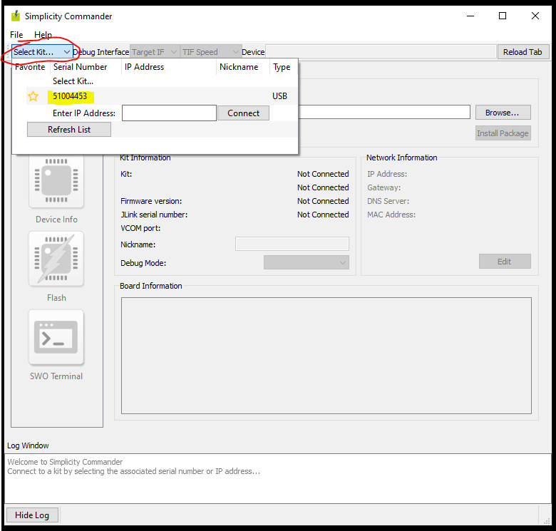
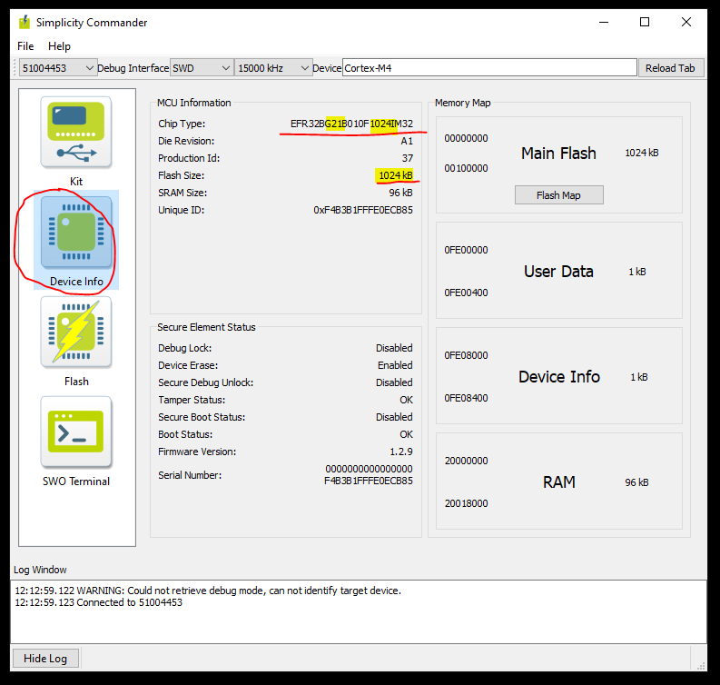
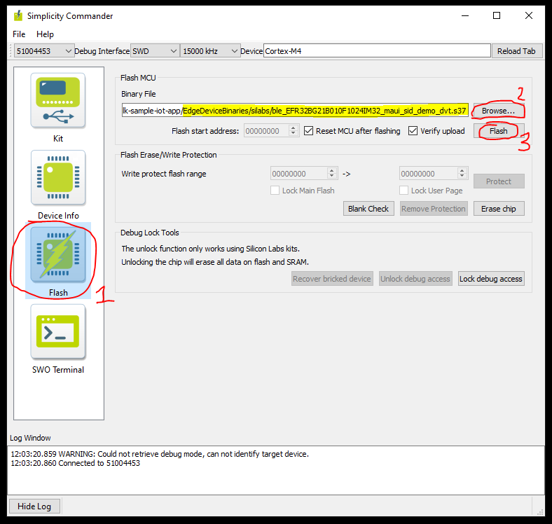
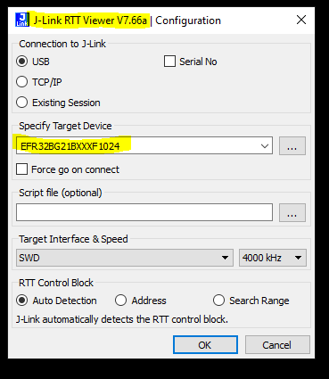

## Brief

## Step by step
1) Open Commander utility and select device from drop-down list.

2) View DeviceInfo to make sure the board is accessible. Check your board type (G21/G24, flash size).

3) Add files that you wish to program:  
   1) Silabs_MFG (from EdgeDeviceProvisioning)
   2) application (from EdgeDeviceBinaries)  

Remember to select binaries that match your board type (e.g. G21/G24, flash size) ! 

4) After programming the board, open RTT terminal and see logs flowing

