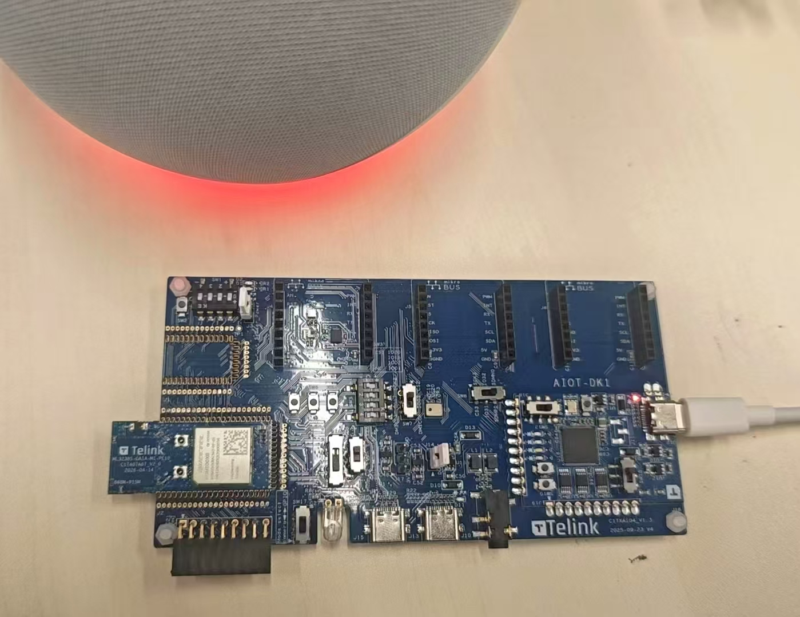
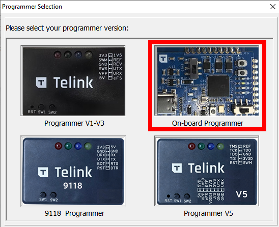
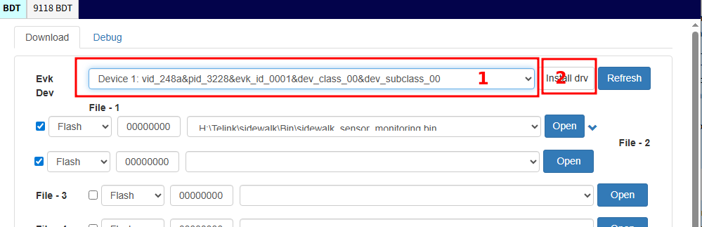
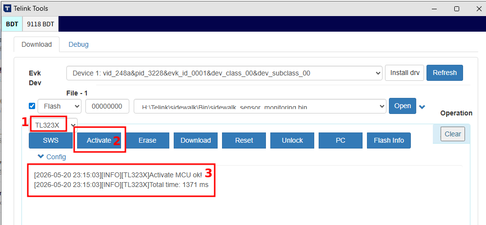
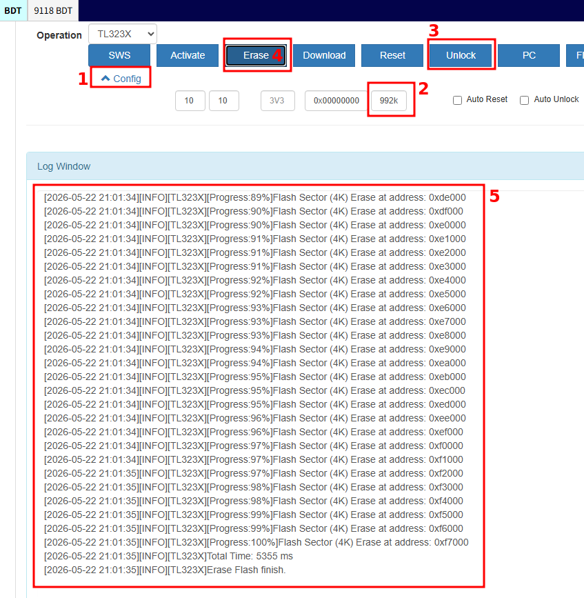
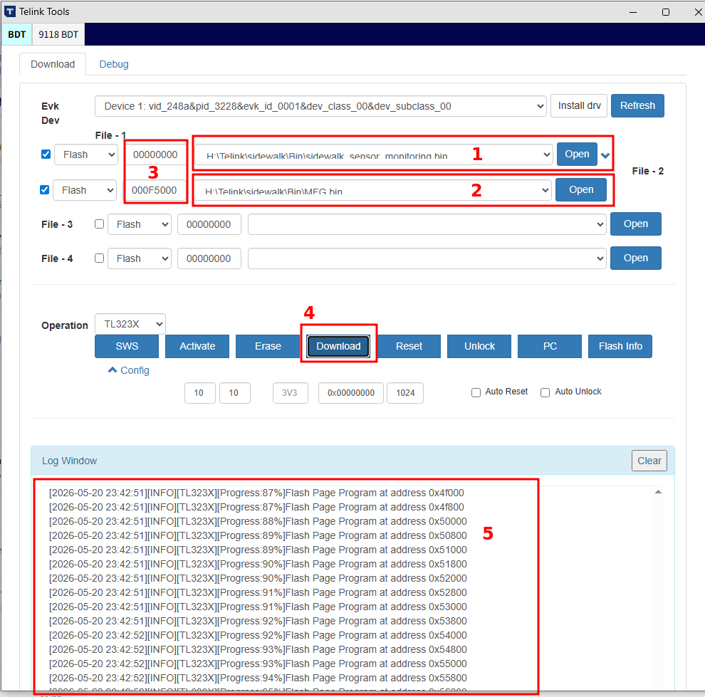

**Note:** For additional details on using Telink's Sidewalk EVK, please reference Telink's Sidewalk User Manual [download here](https://doc.telink-semi.cn/doc/application_note/sidewalk/userguide/AN-26051800-E_Amazon_Sidewalk_User_Manual.pdf). 

Connect the AIOT-DK1 board to the PC via the J12 connector, using the same jumper/switch settings as shown in figure below. 

{height=300px}

 

Start the BDT tool. See Telink Burning and Debugging Tool [download here](https://www.telink-semi.com/development-tools). 

 

Make sure the hardware has been detected by the BDT tool. If the panel (1) is empty, click “Install Drivers” (2) and follow the instructions.

 

Ensure the `TL323X` chip family is selected (1), click "Activate"(2), and make sure communication with the target is established (3).

 

To bring the hardware to a defined and predictable state, it is recommended to erase the entire flash memory. Open the configuration panel (1), enter the flash memory size of "992k" (2), enable “Unlock flash prior to erase” (3), click “ERASE” (4), and monitor the progress (5).

{height=400px}

 

**Note:**

>- Do not erase memory above 0xF8000 (992 KB). Some entries, such as factory calibration data, may be corrupted.

To run the demo application, the flash memory should contain the following two entities:

- "sidewalk_sensor_monitoring.bin" application binary [download here](https://doc.telink-semi.cn/doc/application_note/sidewalk/binary/sidewalk_sensor_monitoring.bin)
- “Telink_MFG.bin” binary (contains the binary blob, shown as “MFG.bin” in the figure)

Load the demo application (1) and the MFG blob (2) into the BDT tool. Make sure the download addresses are correct: 
- "sidewalk_sensor_monitoring.bin" application = 0x000000
- "Telink_MFG.bin" (shown as "MFG.bin" in figure) = 0x0F5000 (3).

Click “Download” (4) and monitor the progress (5).

{height=400px}

 

Now reset the board (by pressing SW2) and enjoy the demo!
