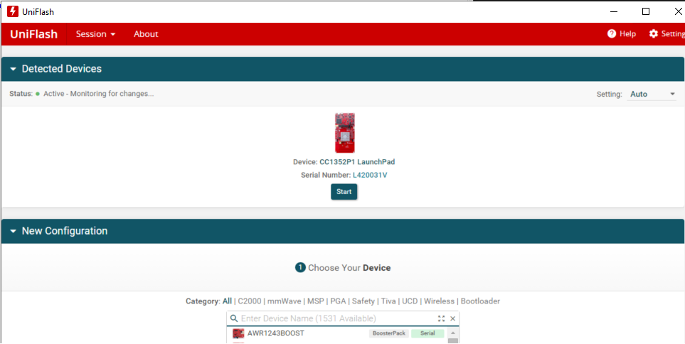
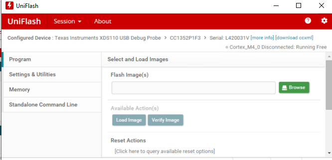
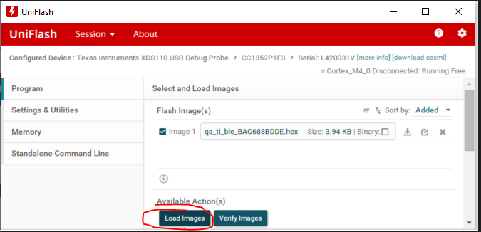
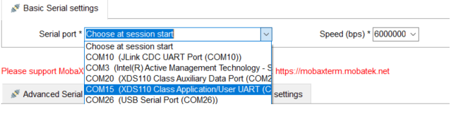

## Step by step
1) Open UniFlash utility and select the device  

2) Go to PROGRAM tab and add files that you wish to program:  
   1) TI_MFG (from EdgeDeviceProvisioning)
   2) application (from EdgeDeviceBinaries)    

3) Flash the board by clicking on 'LOAD FILES'  

4) After programming the board, open UART terminal for logs  
