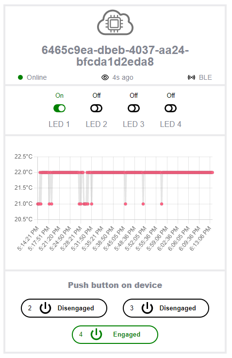
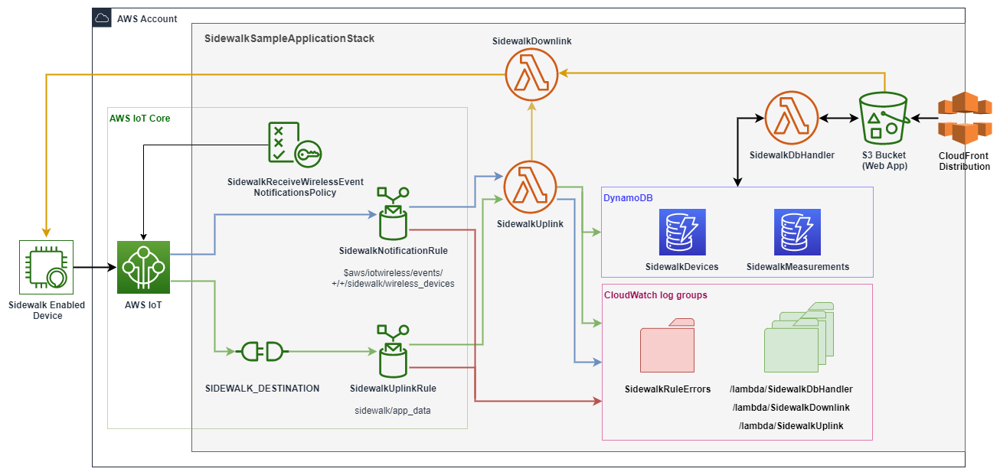

# Amazon Sidewalk Sample IoT App

This is an application that demonstrates a set of simple Sidewalk-based IoT use-cases: sensor monitoring, command-control and alarms/alerts. The sample application communicates with the cloud backend over the secure Sidewalk network.
The Amazon Sidewalk Sample IoT app consists of an edge device (the Hardware Development Kit running the embedded application) and application server (cloud backend with web UI).
The Edge device, after initial setup and registration in Sidewalk network, sends the temperature measurement periodically to the backend. The backend visualizes the data on graphical UI in a form of chart.

A user can engage buttons on the edge device, which is reflected corresponding button icon in the web UI (uplink communication).
A user can toggle LED buttons in the UI view, which is then propagated to corresponding LEDs in the edge device (downlink communication).
It is possible to add multiple edge devices (sensors) to work with a single application server. In such a case, the UI will represent each edge device as a separate tile in the view.

Each sensor must be flashed with an application binary common to all devices, and a device-specific image (a binary that contains serial number, ciphering keys and authorization data individual for each device).
The cloud backend identifies/authorizes each edge device based on the data present in device-specific binary, which ensures end-to-end encryption and a highly secure communication channel.

## Coverage
Sidewalk network is operational in the United States. Check if you have coverage by filling your address in https://coverage.sidewalk.amazon/
If you are not sure whether you have coverage, we recommend you turn on an operational Sidewalk-enabled gateway available (eg. Amazon Echo 4th Gen). A Sidewalk-enabled gateway is a device that has a primary function (e.g. a smart speaker, or a doorbell) and also acts as bridge between edge devices (sensors) and the cloud backend. To turn on Sidewalk on your Amazon Echo 4th Gen device, please check this: https://www.amazon.com/gp/help/customer/display.html?nodeId=GZ4VSNFMBDHLRJUK

|WARNING: Sidewalk is activated only for gateways located in the USA |
|---|

## Prerequisites
- Download and install Python 3.6 or above (https://www.python.org/)
- Create an AWS account (https://aws.amazon.com/)
- Set up an AWS user and its credentials:
  - create user in AWS IAM service ([Creating IAM user](https://docs.aws.amazon.com/IAM/latest/UserGuide/id_users_create.html#id_users_create_console))
  - configure user's authentication credentials ([Managing access keys -> To create an access key](https://docs.aws.amazon.com/IAM/latest/UserGuide/id_credentials_access-keys.html#Using_CreateAccessKey))
  - configure *credentials* file on your local machine ([Boto3 -> QuickStart -> Configuration](https://boto3.amazonaws.com/v1/documentation/api/latest/guide/quickstart.html#configuration))
  - add user permissions to create resources:
    - if your user has Admin permissions, prerequisite is already satisfied, you can skip this point
    - otherwise you need to assign your user a policy with proper permissions:
      - run `python ApplicationServerDeployment/policies/generate_policy.py` script, which will generate personalized policy documents in *ApplicationServerDeployment/policies/* directory 
      - go to the IAM console, create the policy using *DeployStackPolicy.json* content
      - assign created policy to your user
        
      Refer to the [IAM tutorial: Create and attach your first customer managed policy](https://docs.aws.amazon.com/IAM/latest/UserGuide/tutorial_managed-policies.html) for further guidance.

- Install MCU-specific tools for building and flashing:
  - Nordic
    - Flashing Drivers: *Segger JLink* (https://www.segger.com/downloads/jlink/)
    - Flashing Tool: *Nordic nRF Connect* (https://www.nordicsemi.com/Products/Development-tools/nRF-Connect-for-Desktop/Download)
  - TI:
    - Flashing Tool: *UniFlash* (https://www.ti.com/tool/UNIFLASH)
  - SiLabs:
    - Flashing Drivers: *Segger JLink* (https://www.segger.com/downloads/jlink/)
    - Flashing Tool: *Simplicity Commander* (https://community.silabs.com/s/article/simplicity-commander)


Make sure *Simplicity Commander* (for SiLabs) are present in your system PATH environment variable.  
--> Try calling `commander --version` in the terminal to make sure the Simplicity Commander is available


## Getting Started

### 1. Install virtual environment

1. Open command line terminal and navigate to project's top level directory.

2. Install virtualenv and required packages. Just copy/paste commands to the terminal.
   You may need to use either `python` or `python3` alias, depending on your configuration.

- Linux / MacOS:
```
python3 -m pip install --user virtualenv
python3 -m venv sample-app-env
source sample-app-env/bin/activate
python3 -m pip install --upgrade pip
python3 -m pip install -r requirements.txt
python3 -m pip install pyjwt -t ./ApplicationServerDeployment/lambda/authLibs
```

- Windows:
```
python -m pip install --user virtualenv
python -m venv sample-app-env
sample-app-env\Scripts\activate.bat
python -m pip install --upgrade pip
python -m pip install -r requirements.txt
python -m pip install pyjwt -t .\ApplicationServerDeployment\lambda\authLibs
```

### 2. Fill out configuration file
Fill out [config](./config.yaml) file with your details (or leave default values). 

|You need to provide your username and password for the WebApp.|
|---|

| field                 | default value                         | description
| ---                   | ---                                   | ---
| *AWS_PROFILE*         | *default*                             | Profile to be used during the stack creation. If you have a custom named profile in your AWS CLI configuration files, replace 'default' with the name of your profile. Usually, you'd have just one profile named 'default'.
| *DESTINATION_NAME*    | *SensorAppDestination*                | The Sidewalk destination used for uplink traffic routing. Can be any string.
| *HARDWARE_PLATFORM*   | *ALL*                                 | *NORDIC* or *TI* or *SILABS* (or *ALL* if you want to have personalization data generated for all three platforms)
| *USERNAME*            | *null* **(need to be overwritten)**   | User for the WebApp
| *PASSWORD*            | *null* **(need to be overwritten)**   | User's password
| *INTERACTIVE_MODE*    | *True*                                | Enables interactive mode (confirmation prompts).


At this point you may want to run a helper *env_check.py* script to sanity check your environment against the most common errors.
```
python3 env_check.py
```

### 3. Deploy cloud infrastructure

For the sample application to work, you need to deploy necessary resources to your AWS account.  
**Before running the script, ensure that you have sufficient permissions to create resources 
(see: [Prerequisites](#Prerequisites))**.

|All the resources need to be created in *us-east-1* region. If *config* file specifies another region, it will be ignored.
|---|

|WARNING: You will be billed for the usage of AWS resources created by this application. |
|---|

1.  Run deployment script:
    ```
    python3 ApplicationServerDeployment/deploy_stack.py
    ```
    Type `y` when asked to proceed.
    Wait for the deployment to complete (it usually takes ~5 minutes).

2. Go to the URL printed in the console. It is also stored in the [config](./config.yaml) under *WEB_APP_URL*.  
   Log in to the WebApp with *USERNAME* and *PASSWORD* from the config file.  
   Your device will appear in the web app, once embedded app sends a first uplink message.

   |WARNING: The web app is publicly available. Anyone who has the right URL and credentials can interact with your device. |
   |---|

### 4. Provision edge device

This step creates individual personalisation data for the edge device.
It interacts with AWS to create WirelessDevice in the backend, downloads created data and compiles binary blob that can be flashed onto the development kit.

1. Run device provisioning script:
    ```
    python3 EdgeDeviceProvisioning/provision_sidewalk_end_device.py
    ```

2. In *EdgeDeviceProvisioning* directory, you should now see a *DeviceProfile* catalog with *WirelessDevice* subcatalog(s).
   Each _WirelessDevice_ subcatalog represents a singe edge device.
   Personalisation data, in a form of a programmable binary, is available inside.
    ```
   EdgeDeviceProvisioning \
    - DeviceProfile_102d750c-e4d0-4e10-8742-ea3698429ca9 \
       - DeviceProfile.json
       - WirelessDevice_5153dd3a-c78f-4e9e-9d8c-3d84fabb8911\
           --  Nordic_MFG.bin
           --  Nordic_MFG.hex
           --  SiLabs_MFG.nvm3
           --  Silabs_xG21.s37
           --  Silabs_xG24.s37
           --  TI.bin
           --  TI_P1_MFG.hex
           --  TI_P7_MFG.hex
           --  WirelessDevice.json
    ```
   You should be able to flash it onto development kit using the flashing tools specific for your selected platform.


3. You can generate multiple devices by calling `provision_sidewalk_end_device.py` again or by using `--instances` parameter
    ```
    python3 EdgeDeviceProvisioning/provision_sidewalk_end_device.py --instances 5
    ```

### 5. Flash edge device

In this step you will program binaries onto your development kit.
There are two main files to flash: device-specific data from *EdgeDeviceProvisioning* (this programs serial number and authorization keys) and application binary from *EdgeDeviceBinaries* (this programs application logic)

Programming devices depends on used hardware platform. Find dedicated how-tos under the following paths:  
 --> [how-to program Nordic board](./EdgeDeviceBinaries/nordic/doc/_How_to_program.md)  
 --> [how-to program SiLabs board](./EdgeDeviceBinaries/silabs/doc/_How_to_program.md)  
 --> [how-to program TI board](./EdgeDeviceBinaries/ti/doc/_How_to_program.md)  


For detailed instructions on programming the boards, refer to official documentation of given hardware platform.


### 6. Enjoy the application

The edge device will transmit a welcome message to application server, thus informing the application server of its presence.
After the edge device receives an acknowledgement from the application server, it will start sending periodical temperature measurement to the backend. Received data will be represented on the frontend UI.

You can open the terminal to the edge device to see the log flow (eg. data transfer happening periodically).
You can open the URL to web application to see the graphical representation of your edge device in the UI.
Use *username* and *password* defined in the [config](./config.yaml) to log in.  


You can press buttons on the edge device and see the button state changes in the web UI.
You can press LED button in the web UI and see that the LED on your edge device toggles.
You can open the window in your room (or turn on the heating, upon preference) and observe how temperature readouts change in the web UI.

This is what you should see in the Web app after both Server and EdgeDevice start communicating:  


## Sensor Monitoring App - implementation details

Sensor Monitoring Application consists of an AWS infrastructure, which is able to receive, process and store messages coming from a Sidewalk-enabled devices.
It also provides a Web App, which allows user to interact with his development board.

### Cloud infrastructure

Components of the application are depicted by the diagram below. They are connected by arrows, which represent dataflow.
Color denotes message type:
- green --> uplink
- orange --> downlink
- blue --> notification
- red --> error
- black --> application-specific data

|  |
| --- |
| *Sample application - resources and dataflow* |

*SidewalkSampleApplicationStack* CloudFormation stack provides resources that handle messages coming from Sidewalk-enabled devices.
It also creates necessary roles and permissions, not included on the diagram.
Its main components are:

- *SIDEWALK_DESTINATION* - maps a device message to the MQTT topic.
  Each Sidewalk device need to have its destination defined, so that AWS IoT knows where to redirect the message.
  You can change destination of your device using *UpdateDestination* method from the AWS IoT Wireless API.
  All the uplink messages from the *SIDEWALK_DESTINATION* are redirected to the *sidewalk/app_data* topic.


- *SidewalkUplinkRule* - receives uplink messages from the *sidewalk/app_data* topic.
  It forwards incoming uplinks to the *SidewalkUplinkLambda*, where they are further processed.
  In case of error, error messages are stored in the *SidewalkRuleError* log group.


- *SidewalkNotificationRule* - receives event notifications for Sidewalk resources.
  It forwards incoming notifications to the *SidewalkUplinkLambda*.
  In case of error, error messages are stored in the *SidewalkRuleError* log group.


- *SidewalkUplinkLambda* - processes incoming uplinks and notifications. Logs incoming events.
  Uplinks are decoded and, depending on the payload, following actions may be taken:
    - store device data in SidewalkDevices table
    - store sensor data in Measurements table
    - call *SidewalkDownlinkLambda* to respond with the downlink message


- *SidewalkDownlinkLambda* - handles request to send a command to the wireless device.
  Encodes the command to conform to the protocol of the embedded application.


- *SidewalkDbHandlerLambda* - handles requests to fetch data from the *SidewalkDevices* and *Measurements* tables.


- *SidewalkDevices* - stores state of the devices.


- *Measurements* - stores sensor data.


- *S3 Bucket* - hosts web application.


- *SidewalkApiGateway* - handles requests from the WebApp to the *SidewalkDbHandler* and *SidewalkDownlink* lambdas.
  Each request need to be authorized by the token built based on the credentials provided in the [config](./config.yaml).
  Throttling is enabled and allows for up to 30 requests per second and 86400 requests per day.


- *SidewalkUserAuthenticatorLambda*, *SidewalkTokenAuthenticatorLambda* - used by the *SidewalkApiGateway* to verify requests
  (check if user is authorized and token is valid).


- *SidewalkTokenGeneratorLambda* - generates valid token, which is used by the CloudFront distribution to sign requests


|Disclaimer: Token is created based on the credentials (*username* and *password*) stored as base64 encoded string within lambdas' environment variables. We recommend using AWS Secrets Manager, but opted for this solution to save application operation costs.
|---|

### Stack deployment

In order to deploy the application, run the *ApplicationServerDeployment/deploy_stack.py* script, which:
- creates CloudFormation stack
- configures settings, which cannot be set via CloudFormation

**Before running the script, ensure that you have sufficient permissions to create resources 
(see: [Prerequisites](#Prerequisites))**.

|WARNING: You will be billed for the usage of AWS resources created by this application.|
|---|

```
python3 ApplicationServerDeployment/deploy_stack.py
```

In order to delete all the resources created by the application, run:
```
python3 ApplicationServerDeployment/delete_stack.py
```

### Created resources

| Resource Type | Console Location | Name
| --- | --- | --- |
| AWS::CloudFormation::Stack                        | CloudFormation -> Stacks                          | SidewalkSampleApplicationStack
| AWS::IoTWireless::Destination                     | AWS IoT -> Manage -> LPWAN devices -> Destinations| config.yaml -> DESTINATION_NAME
| AWS::IoT::TopicRule                               | AWS IoT -> Message routing -> Rules               | SidewalkNotificationRule
| AWS::IoT::TopicRule                               | AWS IoT -> Message routing -> Rules               | SidewalkUplinkRule
| AWS::IoT::Policy                                  | AWS IoT -> Security -> Policies                   | SidewalkReceiveWirelessEventNotificationsPolicy
| AWS::Lambda::Function                             | Lambda -> Functions                               | SidewalkDbHandlerLambda
| AWS::Lambda::Function                             | Lambda -> Functions                               | SidewalkDownlinkLambda
| AWS::Lambda::Function                             | Lambda -> Functions                               | SidewalkUplinkLambda
| AWS::Lambda::Function                             | Lambda -> Functions                               | SidewalkTokenAuthenticatorLambda
| AWS::Lambda::Function                             | Lambda -> Functions                               | SidewalkTokenGeneratorLambda
| AWS::Lambda::Function                             | Lambda -> Functions                               | SidewalkUserAuthenticatorLambda
| AWS::Lambda::Permission                           | Lambda -> Functions -> SidewalkDbHandlerLambda    | SidewalkDbHandlerLambdaPermissionsForApiGateway
| AWS::Lambda::Permission                           | Lambda -> Functions -> SidewalkDownlinkLambda     | SidewalkDownlinkLambdaPermissionsForApiGateway
| AWS::Lambda::Permission                           | Lambda -> Functions -> SidewalkUplinkLambda       | SidewalkUplinkLambdaPermissionsForNotifications
| AWS::Lambda::Permission                           | Lambda -> Functions -> SidewalkUplinkLambda       | SidewalkUplinkLambdaPermissionsForUplinks
| AWS::Lambda::Permission                           | Lambda -> Functions -> SidewalkUplinkLambda       | SidewalkTokenAuthenticatorLambdaPermissionsForApiGateway
| AWS::Lambda::Permission                           | Lambda -> Functions -> SidewalkUplinkLambda       | SidewalkTokenGeneratorLambdaPermissionsForApiGateway
| AWS::Lambda::Permission                           | Lambda -> Functions -> SidewalkUplinkLambda       | SidewalkUserAuthenticatorLambdaPermissionsForApiGateway
| AWS::Logs::LogGroup                               | CloudWatch -> Log groups                          | SidewalkDbHandlerLambdaLogGroup
| AWS::Logs::LogGroup                               | CloudWatch -> Log groups                          | SidewalkDownlinkLambdaLogGroup
| AWS::Logs::LogGroup                               | CloudWatch -> Log groups                          | SidewalkRuleErrorsLogGroup
| AWS::Logs::LogGroup                               | CloudWatch -> Log groups                          | SidewalkUplinkLambdaLogGroup
| AWS::Logs::LogGroup                               | CloudWatch -> Log groups                          | SidewalkTokenAuthenticatorLambdaLogGroup
| AWS::Logs::LogGroup                               | CloudWatch -> Log groups                          | SidewalkTokenGeneratorLambdaLogGroup
| AWS::Logs::LogGroup                               | CloudWatch -> Log groups                          | SidewalkUserAuthenticatorLambdaLogGroup
| AWS::IAM::Role                                    | IAM -> Roles                                      | SidewalkDestinationRole
| AWS::IAM::Role                                    | IAM -> Roles                                      | SidewalkRuleRole
| AWS::IAM::Role                                    | IAM -> Roles                                      | SidewalkDbHandlerLambdaExecutionRole
| AWS::IAM::Role                                    | IAM -> Roles                                      | SidewalkDownlinkLambdaExecutionRole
| AWS::IAM::Role                                    | IAM -> Roles                                      | SidewalkUplinkLambdaExecutionRole
| AWS::IAM::Role                                    | IAM -> Roles                                      | SidewalkTokenAuthenticatorLambdaExecutionRole
| AWS::IAM::Role                                    | IAM -> Roles                                      | SidewalkTokenGeneratorLambdaExecutionRole
| AWS::IAM::Role                                    | IAM -> Roles                                      | SidewalkUserAuthenticatorLambdaExecutionRole
| AWS::DynamoDB::Table                              | DynamoDB -> Tables                                | SidewalkDevices
| AWS::DynamoDB::Table                              | DynamoDB -> Tables                                | SidewalkMeasurements
| AWS::CloudFront::Distribution                     | CloudFront -> Distributions                       | CloudFrontDistribution
| AWS::CloudFront::OriginAccessControl              | CloudFront -> Origin access                       | CloudFrontOAC
| AWS::CloudFront::OriginRequestPolicy              | CloudFront -> Policies                            | CloudFrontAuthOriginRequestPolicy
| AWS::ApiGateway::Authorizer                       | API Gateway -> APIs -> sensor-monitoring-app      | SidewalkTokenAuthorizer
| AWS::ApiGateway::RestApi                          | API Gateway -> APIs -> sensor-monitoring-app      | SidewalkApiGateway
| AWS::ApiGateway::Resource                         | API Gateway -> APIs -> sensor-monitoring-app      | ApiResource
| AWS::ApiGateway::Resource                         | API Gateway -> APIs -> sensor-monitoring-app      | AuthResource
| AWS::ApiGateway::Resource                         | API Gateway -> APIs -> sensor-monitoring-app      | ProxyResource
| AWS::ApiGateway::Method                           | API Gateway -> APIs -> sensor-monitoring-app      | ApiAuthPostMethod
| AWS::ApiGateway::Method                           | API Gateway -> APIs -> sensor-monitoring-app      | ApiOptionsMethod
| AWS::ApiGateway::Method                           | API Gateway -> APIs -> sensor-monitoring-app      | ApiPostMethod
| AWS::ApiGateway::Method                           | API Gateway -> APIs -> sensor-monitoring-app      | ProxyGetMethod
| AWS::ApiGateway::Method                           | API Gateway -> APIs -> sensor-monitoring-app      | ProxyOptionsMethod
| AWS::ApiGateway::Deployment                       | API Gateway -> APIs -> sensor-monitoring-app      | SidewalkApiGatewayDeployment
| AWS::ApiGateway::UsagePlan                        | API Gateway -> APIs -> sensor-monitoring-app      | SidewalkApiGatewayDeployment
| AWS::S3::Bucket                                   | Amazon S3 -> Buckets                              | SidewalkWebAppBucket
| AWS::S3::BucketPolicy                             | Amazon S3 -> Buckets                              | S3BucketPolicy

### Username / password change
In order to change *username* and *password* for the WebApp, please update values in the [config](./config.yaml) file and rerun deployment script:
```
python3 ApplicationServerDeployment/deploy_stack.py
```

### Web App

After the deployment, web application is available under the link stored in [config -> WEB_APP_URL](./config.yaml).

   |WARNING: The web app is publicly available. Anyone who has the right URL and credentials can interact with your device. |
|---|

Device will appear in the web app, once embedded app sends a first uplink message.
Web app displays device state as well as sensor data, collected in the previous hour.
User can engage buttons on the edge device, which is also reflected in the web UI (uplink communication).
User can also toggle LED buttons in the UI view, which triggers toggle LED request sent to the edge device (downlink communication).

## Security

The sample code; software libraries; command line tools; proofs of concept; templates; or other related technology (including any of the foregoing that are provided by our personnel) is provided to you as AWS Content under the AWS Customer Agreement, or the relevant written agreement between you and AWS (whichever applies). You should not use this AWS Content in your production accounts, or on production or other critical data. You are responsible for testing, securing, and optimizing the AWS Content, such as sample code, as appropriate for production grade use based on your specific quality control practices and standards. Deploying AWS Content may incur AWS charges for creating or using AWS chargeable resources, including but not limited to running Amazon Lambda instances or using Amazon Timestream storage.

See [CONTRIBUTING](./CONTRIBUTING.md#security-issue-notifications) for more information.

## Best Practices

As stated above, you should not use this AWS Content in your production accounts, or on production or other critical data. If you do decied to use this as a template for your production system it is recommended you follow engineering best practices. See the following for some good :

- Never trust an input as malicious users may try to pass unexpected values. Always use server-side validation.
- Security related parameters should be implemented via AWS Secrets Manager. Parameter Store with secure string could also be used. However, for sensitive data such as passwords, AWS Secrets Manager is a better option as it provides the ability to rotate secrets.
- X-ray should be enabled in upstream services (where applicable) to enable tracing.
- S3 buckets should have server access logging enabled to provide detailed records for the requests that are made to a bucket.
- All S3 buckets should have SSE enabled for data-at-rest.
- Static website buckets should not have a open world read bucket policy but rather be a private bucket with OAI restricted access via CloudFront URLs only.
- You can use HTTPS (TLS) to help prevent potential attackers from eavesdropping on or manipulating network traffic using person-in-the-middle or similar attacks. You should allow only encrypted connections over HTTPS (TLS) using the `aws:SecureTransport` condition on Amazon S3 bucket policies.
- Use advanced managed services such as Amazon Macie to assists in discovering personal data. This is an account level setting.
- Anti-sniping controls protect against unknowingly uploading data to a bucket that belongs to another account. If the solution provides the ability to upload data to a customer-specified bucket, whether part of the solution itself or part of the deployment, it shuold use anti-sniping controls to prevent this vulnerability.
- Determine if attribute-level encryption should be implemented client side in order to help protect sensitive data like credit card numbers or social security numbers.
- Determine if Point-in-time Recovery (PITR) should be used to automatically take continuous backups of the DynamoDB data. Amazon DynamoDB service can back up the data with per-second granularity and restore it to any single second from the time PITR was enabled up to the prior 35 days. DynamoDB continuous backups represent an additional layer of insurance against accidental loss of data on top of on-demand backups. If continuous backups cannot be use then at least on-demand backups should be considered.
- A solution's DAX cluster data at rest (i.e. data in cache, configuration data and log files) should be encrypted using Server-Side Encryption (SSE) in order to protect it from unauthorized access to the underlying storage.
- A VPC endpoint enables the ability to privately connect a VPC to supported AWS services and VPC endpoint services powered by PrivateLink without requiring an internet gateway, NAT device, VPN connection, or AWS Direct Connect connection.
- Timestream provides data-in-transit encryption. If the data is sensitive and warrants  the need to be encrypted before Amazon Timestream SDK call, client-side encryption should be considered.
- Amazon Timestream is integrated with Cloudtrail. Cloudtrail should be enabled for auditing in case of any security incident.

## License

This library is licensed under the MIT-0 License. See the [LICENSE](LICENSE) file.
